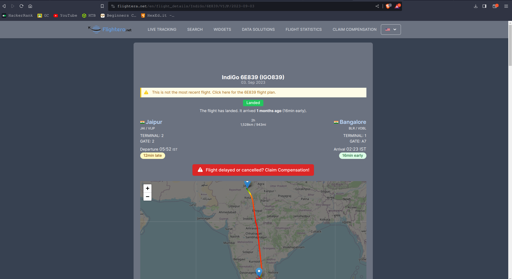
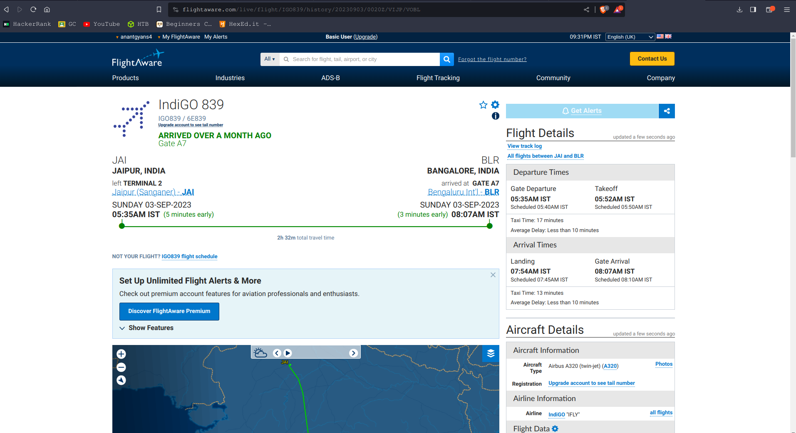
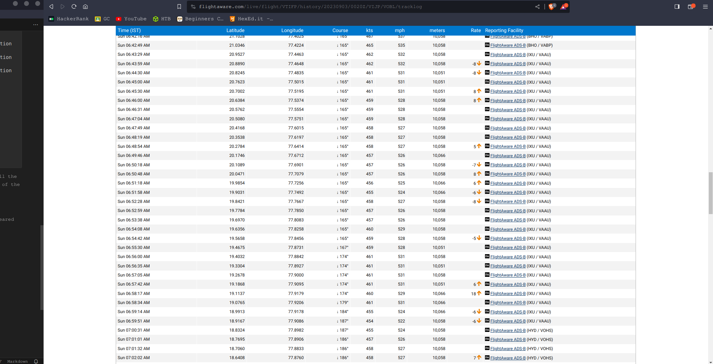

# MISC
## `Height of joey's plane`
### Points
300
### Challenge Description
```
Mr. Joey Miller this, miller there, miller where. He wants to find the height of his plane after a year. Help him find the lat and long(in decimal upto 4 decimal), speed(mph) and height(feet) of the plane a year and 24 secs after this photo was taken.

flag format: d4rk{lat_long_speed_height}c0de
```
### File attached


### Explanation
Wee see that an image is given, It's of a plane `(airline- indigo)` and it was the `aircraft - VT-IFP` of type `A320`.

Now in order to find information of the image i used exiftool command `exiftool <file name>`, by this command i got some more information about the image:
```
> exiftool catch\ me\ if\ you\ can.jpg 
ExifTool Version Number         : 12.40
File Name                       : catch me if you can.jpg
Directory                       : .
File Size                       : 2.7 MiB
File Modification Date/Time     : 2023:10:23 20:02:48+05:30
File Access Date/Time           : 2023:10:23 20:09:56+05:30
File Inode Change Date/Time     : 2023:10:23 20:03:21+05:30
File Permissions                : -rw-rw-r--
File Type                       : JPEG
File Type Extension             : jpg
MIME Type                       : image/jpeg
Exif Byte Order                 : Big-endian (Motorola, MM)
Camera Model Name               : KB2001
Make                            : OnePlus
Date/Time Original              : 2022:09:03 06:55:36
White Balance                   : Auto
Create Date                     : 2022:09:03 06:55:36
ISO                             : 100
Focal Length                    : 4.7 mm
Warning                         : Invalid EXIF text encoding for UserComment
User Comment                    : Oplus_0
Exposure Time                   : 1/667
Flash                           : Off, Did not fire
Light Source                    : Unknown
Orientation                     : Horizontal (normal)
Modify Date                     : 2022:09:03 06:55:36
JFIF Version                    : 1.01
Resolution Unit                 : None
X Resolution                    : 1
Y Resolution                    : 1
Profile CMM Type                : 
Profile Version                 : 4.3.0
Profile Class                   : Display Device Profile
Color Space Data                : RGB
Profile Connection Space        : XYZ
Profile Date Time               : 0000:00:00 00:00:00
Profile File Signature          : acsp
Primary Platform                : Unknown ()
CMM Flags                       : Not Embedded, Independent
Device Manufacturer             : 
Device Model                    : 
Device Attributes               : Reflective, Glossy, Positive, Color
Rendering Intent                : Media-Relative Colorimetric
Connection Space Illuminant     : 0.9642 1 0.82491
Profile Creator                 : 
Profile ID                      : 0
Profile Description             : sRGB
Red Matrix Column               : 0.43607 0.22249 0.01392
Green Matrix Column             : 0.38515 0.71687 0.09708
Blue Matrix Column              : 0.14307 0.06061 0.7141
Red Tone Reproduction Curve     : (Binary data 40 bytes, use -b option to extract)
Green Tone Reproduction Curve   : (Binary data 40 bytes, use -b option to extract)
Blue Tone Reproduction Curve    : (Binary data 40 bytes, use -b option to extract)
Media White Point               : 0.9642 1 0.82491
Profile Copyright               : Google Inc. 2016
Image Width                     : 4000
Image Height                    : 3000
Encoding Process                : Baseline DCT, Huffman coding
Bits Per Sample                 : 8
Color Components                : 3
Y Cb Cr Sub Sampling            : YCbCr4:2:0 (2 2)
Image Size                      : 4000x3000
Megapixels                      : 12.0
Shutter Speed                   : 1/667
Focal Length                    : 4.7 mm
```
now as it was written in the challenge description that i have to tell the lat and long(in decimal upto 4 decimal), speed(mph) and height(feet) of the plane a year and 24 secs after this photo was taken.

So the i have to find it on date 3 september 2023 at 6:56

I searched this information on web browser and this [website](https://www.flightera.net/en/planes/VT-IFP) appeared:

further in the website i found that it's code name was `IGO839 ` of the flight on 3 september 2023



now I searched `IndiGo 6E839 (IGO839) rout info at 3 sept 2023` on web browser then this [website](https://www.flightaware.com/live/flight/IGO839) appered but it was showing the information about the flight on 21 oct 2023 so on further digging website i found the info about the asked flight:

the

 the all info we needed in one place(yay!)
 ```
Lat      :19.4032
Long     :77.8842
Mph      :531
Altitute :33000
```

### Flag
`d4rk{19.4032_77.8842_531_33000}c0d3`
